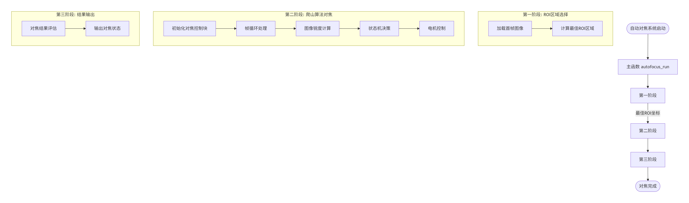
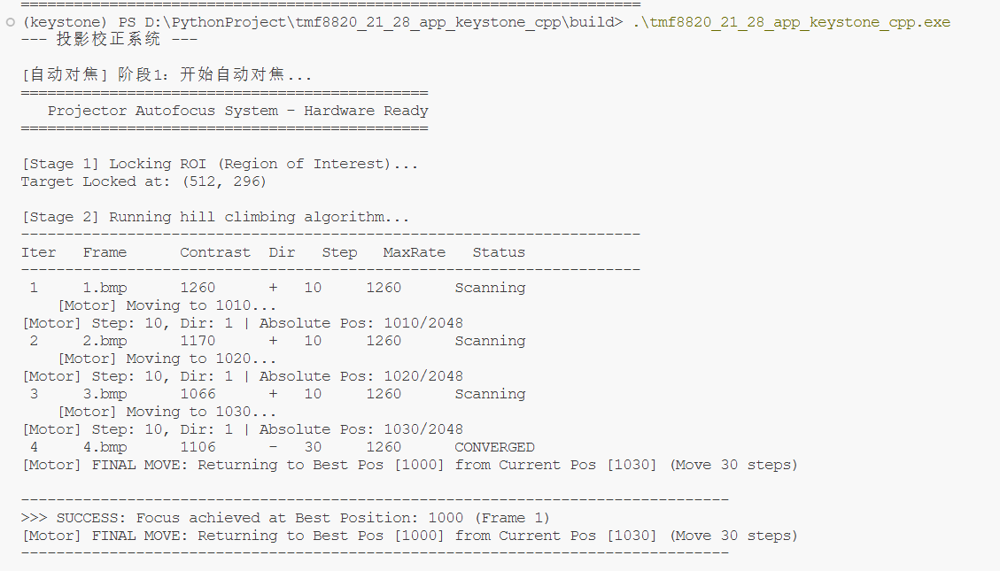
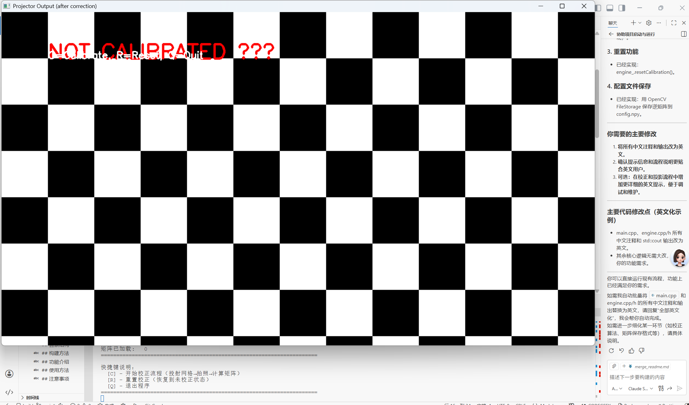
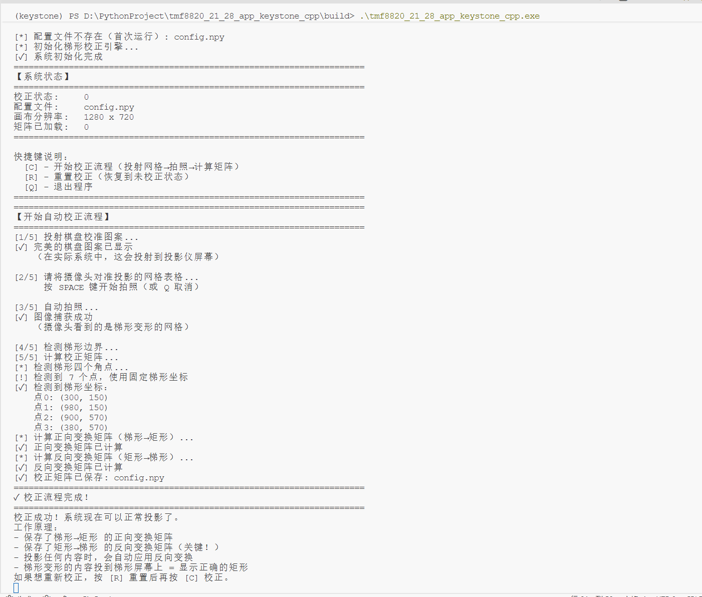
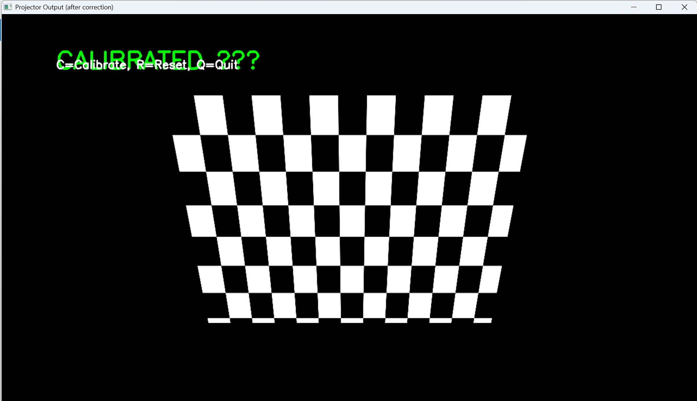
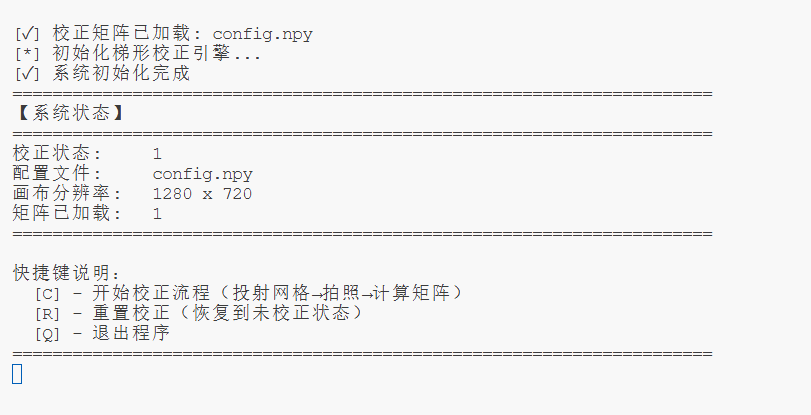

# tmf8820_21_28_app_keystone_cpp

本项目为原C++版tmf8820_21_28_app_keystone和C++版Autofocus的合并版。


## 目录结构
```text
assets/
    1.bmp   对焦爬山算法使用的30张图片
    2.bmp
    ...
    30.bmp
    generate_images.py  产生这30张图片的python脚本
build/
    config.npy  梯形校正的参数
include/
    core/
        autofocus.h   对焦的库头文件
        engine.h      梯形校正
        readBMP.h     读取BMP图片
        util.h        梯形校正使用的工具函数
src/
    core/
    autofocus/
        autofocus.cpp  对焦的具体实现，涉及反差值计算、找最大反差值、爬山算法等
        engine.cpp     梯形校正的实现涉及的函数
        readbmp.cpp    读取BMP图片的实现
        util.cpp       梯形校正使用的工具函数的实现
    main.cpp  主函数

tests/  准备的测试目录，目前为空
```
## 构建方法

```sh
mkdir build
cd build
cmake ..
cmake .. -G "MinGW Makefiles" -DOpenCV_DIR="D:/你的OpenCV编译路径/build"
cmake --build .
python generate_images.py    
./tmf8820_21_28_app_keystone

```

如需OpenCV等第三方库，请先安装并配置好环境。

## 功能介绍
本项目实现了tmf8820_21_28_app_keystone和Autofocus两个项目，其中tmf8820_21_28_app_keystone实现了tmf8820的梯形校正，Autofocus实现了对焦爬山算法。在这次的结合体中，实现了先对焦再梯形校正的流程。
其中对焦流程图：

对焦的终端输出：

其中梯形校正流程：
梯形校正时投影仪内部播放（矩形）的第一张照片为：

然后按下C键，开始校正流程
然后把这张照片投影到墙上，墙上显示的图像为一个梯形：【这个在算法内部就解决了，没有显示出来图片】

然后按下空格键，即拍照投在墙上的这个梯形，然后就以这个梯形和投影仪内部的矩形为基准，求梯形校正的矩阵，存这个矩阵的逆到config.npy里。
没有config.npy文件时，终端输出：

下次再运行程序发现config.npy存在，就直接读取这个矩阵，然后进行梯形校正。在投影仪内部就乘以矩阵的逆来预校正，这样就可以保证投影仪内部发出梯形，投到墙上就是矩形。

有config.npy文件时,终端输出：


按下R键可以重置，即删掉config.npy文件，下次再运行程序发现config.npy不存在，就重新进行梯形校正。


